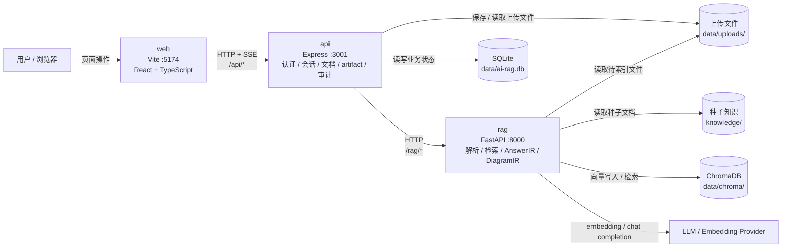
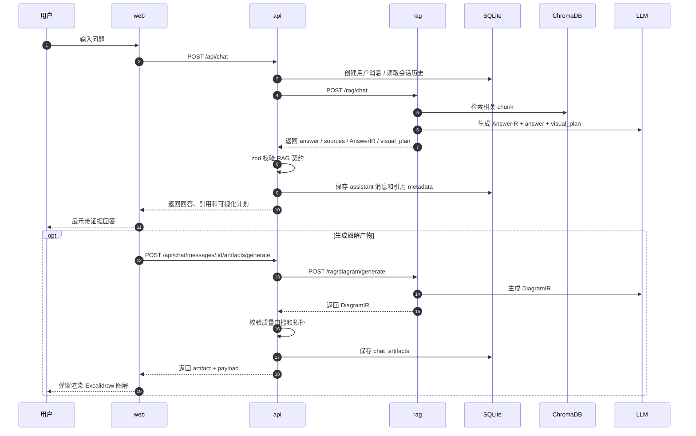
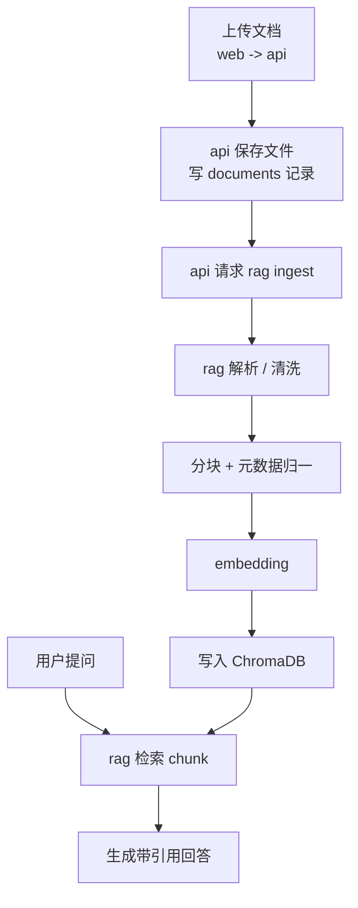

# 运行时拓扑与数据流

这份图是 [项目架构总览](../项目架构总览.md) 的可视化补充，描述当前 `web` / `api` / `rag` 三服务运行时边界、主要存储和核心链路。

## 运行时拓扑

## 问答与结构化产物流

## 文档导入与检索流

## 边界原则

- `web` 只访问 `api`，不直连 `rag`、SQLite 或 ChromaDB。
- `api` 负责用户身份、会话、权限、持久化、审计和契约校验。
- `rag` 负责解析、检索、模型调用和结构化 IR 生成，不保存用户会话状态。
- `AnswerIR` / `DiagramIR` 的破坏性契约问题必须停在 `api/src/services/ragClient.ts` 边界。
