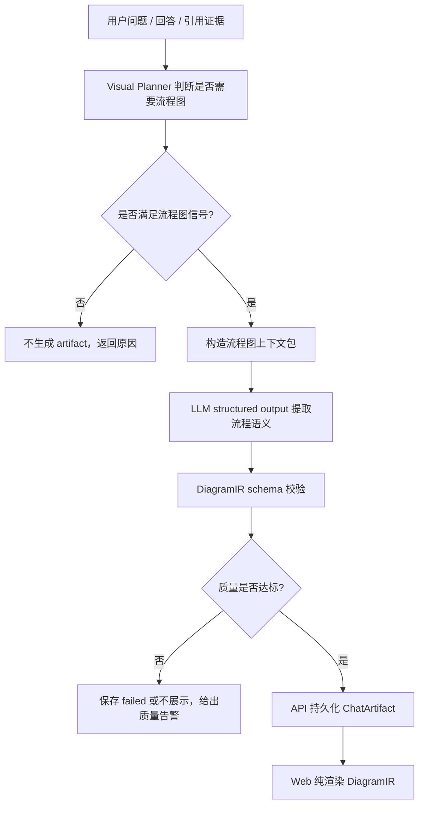

# 流程图语义生成架构方案

## 1. 目标定位

本方案用于把“对话或文档内容如何生成高质量流程图”沉淀为项目级规则。它不是单纯把聊天记录画出来，而是服务企业级文档知识库场景：

- SOP、设备操作、质量判定、异常处理、审批审核等内容，要能生成准确流程图。
- 回答正文、引用片段、章节标题、文档标题都可以作为图解证据。
- 图结构由 RAG / LLM structured output 生成，API 负责契约、权限、持久化和质量门槛，前端只负责渲染和交互。
- 低证据、低信息、闲聊或无明确流程的问题，不应强行生成有模有样的流程图。

一句话目标：

```text
从回答和证据中提炼流程语义 -> 输出可校验 DiagramIR -> 前端高质量渲染
```

## 2. 当前差距

当前项目已经有 DiagramIR、Visual Planner、artifact 持久化和 Excalidraw 渲染，但流程图质量仍有不足：

- 流程图和思维导图的语义边界不够清晰，容易把关键词列表画成流程。
- 流程图抽取没有完整覆盖角色、动作、判断、分支、循环、异常回流。
- 判断节点缺少硬约束，例如一个判断没有完整的“是/否、通过/失败”等分支。
- 对多角色场景缺少泳道表达，无法清楚区分用户、系统、审核员、设备、AI 的职责。
- 复杂对话或长文档没有主流程 / 子流程拆分机制，容易生成过密图。
- 前端已经向纯渲染层收敛，但仍需要更稳定的布局元数据和降级策略。

## 3. 设计原则

### 3.1 企业知识库优先

流程图的核心输入不是聊天流水账，而是“回答中可被证据支撑的业务流程”。对话只是一种触发方式。

### 3.2 语义在 RAG，治理在 API，展示在 Web

```text
rag
  提取角色、动作、判断、分支、循环、证据，生成 DiagramIR

api
  校验 DiagramIR、判断质量门槛、持久化 artifact、写审计和返回前端

web
  根据 DiagramIR 渲染图形、缩放、弹窗、定位、导出和降级展示
```

### 3.3 不强行出图

满足以下任一情况时，Visual Planner 应拒绝自动生成流程图：

- 回答过短，且没有步骤、条件、时序或处理动作。
- 引用证据为空或证据覆盖不足。
- 用户输入是闲聊、无意义文本或低信息问题。
- 只能提取名词列表，无法形成动作或判断链路。

### 3.4 标准符号少而准

流程图默认只使用基础符号：

| 节点类型 | 图形 | 用途 |
|----------|------|------|
| start / end | 椭圆 | 流程开始和结束 |
| input / output | 平行四边形 | 用户输入、系统输出、资料展示 |
| step / action | 矩形 | 执行动作、处理步骤 |
| decision | 菱形 | 条件判断、问答选择、校验结果 |
| subflow | 双边矩形或特殊矩形 | 可展开子流程 |

## 4. 流程图生成流水线



## 5. 语义抽取规则

### 5.1 输入清洗

RAG 在构造流程图上下文时，先做轻量清洗：

- 剔除闲聊、语气词、重复确认、纯情绪表达。
- 保留动作、指令、问答、结果、条件、异常、要求。
- 将回答正文和引用片段分开标注，避免把无证据内容误认为事实。

### 5.2 核心要素

| 要素 | 示例 | 进入 DiagramIR 的方式 |
|------|------|-----------------------|
| 参与角色 | 用户、系统、审核员、设备、AI | `lane` 或节点 metadata |
| 核心行为 | 上传、校验、检索、推送、隔离、复核 | step / action |
| 判断条件 | 是否通过、是否有数据、是否超限 | decision |
| 分支结果 | 是/否、通过/失败、同意/驳回 | edge label |
| 循环回流 | 重新提交、重试、复核 | edge metadata `loop: true` |
| 最终结果 | 办结、终止、上线、归档 | end |

### 5.3 场景分类

| 场景 | 处理方式 |
|------|----------|
| 线性流程 | 按时序生成 start -> step -> end |
| 分支流程 | 一个问题或校验结果生成一个 decision，分支边必须有标签 |
| 循环流程 | 失败、重试、重新上传、重新确认等生成回流边 |
| 异常处理 | 异常 / 失败分支默认放右侧或下方，避免干扰主线 |
| 多角色流程 | 生成 swimlane，按角色分栏展示 |
| 长流程 | 拆成主流程 + 子流程，主图只保留关键节点 |

### 5.4 命名规则

- 节点 label 控制在 10 到 14 个中文字符内。
- 动作节点使用“动词 + 对象”，例如“检索文档”“校验格式”“隔离异常品”。
- 判断节点使用问句，例如“是否通过？”“是否找到证据？”。
- 分支边必须带短标签，例如“是”“否”“通过”“失败”“需复核”。
- 禁止把整段回答、长引用或解释性段落塞进节点。

## 6. DiagramIR 扩展建议

在现有 DiagramIR 基础上逐步增加可选字段，不一次性破坏兼容：

```ts
type FlowNodeKind =
  | "start"
  | "end"
  | "input"
  | "output"
  | "step"
  | "action"
  | "decision"
  | "subflow";

type FlowEdgeRelation =
  | "sequence"
  | "condition"
  | "loop"
  | "fallback";

type DiagramNodeMetadata = {
  lane?: string;
  source_text?: string;
  source_ids?: string[];
  confidence?: number;
  layout?: {
    x: number;
    y: number;
    width: number;
    height: number;
  };
};

type DiagramEdgeMetadata = {
  label_required?: boolean;
  loop?: boolean;
  branch?: "yes" | "no" | "pass" | "fail" | "fallback";
};
```

## 7. Schema 与质量校验

流程图必须通过以下校验：

- 至少有一个 start 和一个 end。
- step / action / decision 至少有一个业务节点。
- decision 节点必须至少有 2 条出边。
- decision 出边必须有标签。
- 普通流程边必须从上游指向下游，不能出现无意义反向边。
- loop 边必须显式标注 `metadata.loop = true`。
- 节点数量默认不超过 12；超过时要求拆子流程。
- 每个业务节点至少绑定一条回答或引用证据，无法绑定时降低质量分。
- 不允许孤立节点；除 start / end 外，不允许断头流程。

## 8. 布局策略

### 8.1 普通流程图

- 默认 top-down。
- 主线垂直向下。
- 判断分支左右展开。
- 失败、异常、重试分支优先放右侧。
- 回流线使用弯折线或曲线指回上游节点。

### 8.2 泳道流程图

- 当角色数量大于等于 2，且节点能明确归属角色时启用。
- 泳道默认横向分栏，流程仍从上到下。
- 跨泳道连线表示职责交接。
- 角色未知时不强行生成泳道，避免误导。

### 8.3 长流程降级

- 先生成主流程，只保留关键 6 到 10 个节点。
- 复杂分支生成 subflow 节点。
- 子流程作为后续 artifact 或二级弹窗展开。

## 9. LLM Structured Output Prompt 要点

流程图生成提示词应强调：

- 只从回答正文和引用证据中提取流程，不要补不存在的步骤。
- 先识别角色、动作、判断、分支、循环、结果。
- 判断节点必须是一个明确问题。
- 每个判断节点必须覆盖主要结果分支。
- 无法形成流程时返回 `can_generate: false` 和原因。
- 节点 label 必须短句化。
- 输出 JSON，禁止 Markdown 流程图文本。

## 10. API 编排

API 调用 RAG 生成 artifact 时需要传递：

- 用户原始问题
- 回答正文
- 引用 source 列表
- 章节标题和文档标题
- 当前会话可用的简短上下文
- 请求的 artifact type

API 收到 DiagramIR 后：

1. 用 zod / schema 校验边界契约。
2. 计算质量门槛和展示策略。
3. 低质量时不展示或展示失败原因。
4. 高质量时保存为 `chat_artifacts`。
5. 返回给前端渲染。

## 11. Web 渲染要求

前端只做三件事：

- 根据节点、边、layout、renderer metadata 渲染图。
- 处理弹窗、缩放、只读白板、错误态和重生成入口。
- 在旧 artifact 缺少布局或布局明显越界时做安全兜底。

前端不做：

- 不提取关键词。
- 不判断业务节点类型。
- 不决定流程分支。
- 不生成证据挂载。
- 不硬编码电池产线业务词表。

## 12. 分阶段任务

### 第一阶段：语义规则和 schema 收口

- 补齐 flowchart 节点类型和边类型。
- 补齐 decision 分支、loop 回流和证据覆盖校验。
- 更新 LLM structured output prompt。

### 第二阶段：RAG 生成质量

- 实现角色 / 动作 / 判断 / 分支 / 循环抽取。
- 增加低信息拒绝生成策略。
- 增加流程图评估样例。

### 第三阶段：API 质量门槛

- API 对 DiagramIR 做边界校验和质量打分。
- 低质量 artifact 不污染回答区。
- 保存失败原因，方便调试和治理。

### 第四阶段：Web 渲染升级

- 普通流程图使用 top-down 布局。
- 支持 decision 分支标签、loop 回流线。
- 支持泳道图的最小可用渲染。

### 第五阶段：验收与产品化

- 用 SOP、异常处理、上传校验、审核发布、多角色协作五类样例做回归。
- 确认低信息输入不会生成假流程图。
- 确认刷新页面后 artifact 可恢复。

## 13. 验收标准

- 线性流程：节点顺序正确，start / end 完整。
- 分支流程：判断节点、分支标签和路径完整。
- 循环流程：回流边明确，不和主线混淆。
- 多角色流程：泳道归属清楚，跨角色交接清楚。
- 低信息输入：不生成流程图，给出可解释原因。
- 图形质量：节点不重叠、箭头方向正确、文字不溢出、连线不穿过核心文本。

